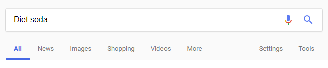
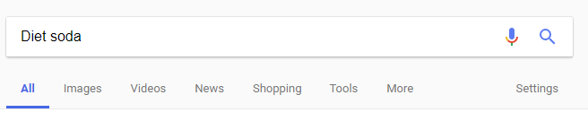

# FixGoogleSearchTabOrdering
This script fixes the ordering of your Google search tabs instead of having the ordering change depending on yours earch terms. Feel free to edit the ordering yourself in the script contents (Its not complicated).

Google should fire its dumbass designers for implementing such a shitty and inconvenient 'feature'

## Installation instructions

Theres quite a few ways to install this, but heres the recommended way
1) Install Tampermonkey
2) Create new script in dashboard
3) Copy paste contents in and save

Alternatively, you can install directly into Chrome by doing this
1) Download FixGoogleSearchTabOrdering.js 
2) Browse in Chrome to [chrome://extensions]
3) Click and drag the js file into the extensions page. (If Chrome just opens it up as a text document then try the above method instead)

### Before

### After 

